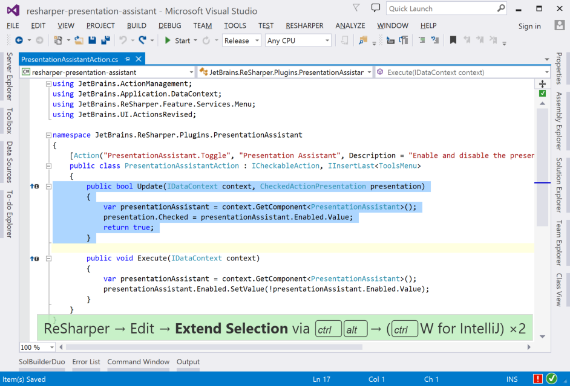
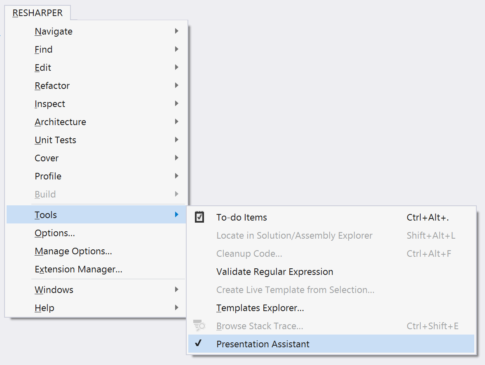

# Presentation Assistant for ReSharper

Presentation Assistant is an extension for ReSharper 9.0 that will display the keyboard shortcuts for the currently executing action. Useful for demos, but also handy for pair programming - easily answer those "how did you do that?" questions.

## Features

* Displays invoked ReSharper actions, showing any shortcuts. Defaults to Visual Studio keymap, showing the IntelliJ shortcut if it's different. (Visual Studio commands will be added in a future version.)
* Shows multiple invocations of a shortcut.
* Supports Visual Studio's Light and Dark themes.

Any suggestions? Found a bug? Please [add an issue](https://github.com/JetBrains/resharper-presentation-assistant/issues)!

## Download

You can download the plugin via the Extension Manager. Once installed, you can enable and disable it by selecting the "Presentation Assistant" item in the ReSharper &rarr; Tools menu.

